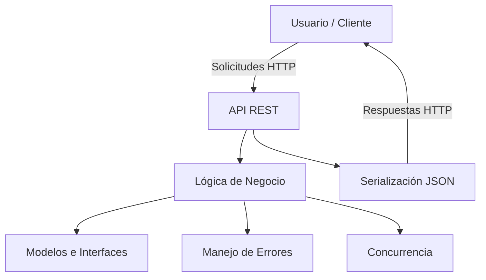

# Arquitectura del Sistema

## Sistema de Gestión E-commerce en Golang

**Estudiante:** Elizabeth Cardona
**Asignatura:** Programación Orientada a Objetos
**Lenguaje:** Golang
**Fecha:** Junio 2026

---

# 1. Descripción General

El Sistema de Gestión E-commerce es una aplicación desarrollada en Golang que permite administrar productos, procesar pedidos y exponer funcionalidades mediante servicios web REST.

La solución integra los conceptos estudiados durante las cuatro unidades de la asignatura, incluyendo programación orientada a objetos, interfaces, encapsulación, manejo de errores, serialización JSON, concurrencia y pruebas de software.

El objetivo principal es demostrar la aplicación práctica de los fundamentos de desarrollo de software mediante una arquitectura modular, escalable y mantenible.

---

# 2. Objetivo del Sistema

Desarrollar un sistema de gestión E-commerce que permita administrar productos y pedidos utilizando servicios web REST, aplicando buenas prácticas de programación en Golang, principios de orientación a objetos, manejo de errores y procesamiento concurrente.

---

# 3. Arquitectura General del Sistema



## Descripción de la Arquitectura

La arquitectura implementa una separación clara de responsabilidades mediante capas lógicas que facilitan el mantenimiento y la escalabilidad del sistema.

### Capa de Presentación (API REST)

Responsable de recibir solicitudes HTTP y devolver respuestas estructuradas.

Funciones:

* Recepción de solicitudes GET, POST y PUT.
* Validación básica de datos.
* Comunicación con la lógica de negocio.
* Serialización de respuestas JSON.

### Capa de Lógica de Negocio

Implementa las reglas principales del sistema.

Responsabilidades:

* Procesamiento de pedidos.
* Validación de inventario.
* Gestión de productos.
* Coordinación de operaciones concurrentes.

### Capa de Modelos e Interfaces

Representa las entidades principales y los contratos del sistema.

Componentes:

* Product
* IProduct

Beneficios:

* Encapsulación.
* Abstracción.
* Bajo acoplamiento.
* Reutilización.

### Capa de Manejo de Errores

Controla situaciones excepcionales durante la ejecución.

Ejemplos:

* Producto inexistente.
* Stock insuficiente.
* Solicitudes inválidas.
* Errores de procesamiento.

### Capa de Concurrencia

Implementada utilizando herramientas nativas de Golang:

* Goroutines
* sync.WaitGroup
* sync.RWMutex

Permite procesar múltiples solicitudes simultáneamente de forma segura.

### Serialización JSON

Toda la comunicación entre cliente y servidor utiliza formato JSON para garantizar interoperabilidad y compatibilidad con aplicaciones modernas.

---

# 4. Estructura del Proyecto

```text
ecommerce-go-system/
├── docs/
│   ├── architecture.md
│   └── cronograma.md
│
├── internal/
│   ├── api/
│   │   └── handlers.go
│   │
│   ├── errors/
│   │   └── domain.go
│   │
│   ├── interfaces/
│   │   └── contracts.go
│   │
│   ├── models/
│   │   └── product.go
│   │
│   └── services/
│       └── order.go
│
├── tests/
│   ├── api_test.go
│   ├── product_test.go
│   └── service_test.go
│
├── .gitignore
├── LICENSE
├── README.md
├── go.mod
└── main.go
```

## Descripción de la estructura

* **docs/**: documentación técnica y planificación del proyecto.

* **docs/architecture.md**: documento de arquitectura del sistema.

* **docs/cronograma.md**: planificación y cronograma de desarrollo.

* **internal/api/**: controladores y endpoints de los servicios web REST.

* **internal/api/handlers.go**: implementación de rutas y manejo de solicitudes HTTP.

* **internal/errors/**: definición de errores personalizados del dominio.

* **internal/errors/domain.go**: catálogo de errores de negocio utilizados por el sistema.

* **internal/interfaces/**: contratos e interfaces utilizadas por la aplicación.

* **internal/interfaces/contracts.go**: definición de interfaces para desacoplar componentes.

* **internal/models/**: entidades y modelos de negocio.

* **internal/models/product.go**: estructura y comportamiento de los productos.

* **internal/services/**: implementación de la lógica de negocio.

* **internal/services/order.go**: procesamiento de pedidos, validaciones y control de inventario.

* **tests/**: pruebas unitarias e integración del sistema.

* **tests/api_test.go**: pruebas de los servicios web.

* **tests/product_test.go**: pruebas de la entidad Product.

* **tests/service_test.go**: pruebas de la lógica de negocio.

* **main.go**: punto de entrada principal de la aplicación.

* **go.mod**: gestión de dependencias y configuración del módulo Go.

* **README.md**: documentación principal del proyecto.

* **LICENSE**: licencia de distribución del software.

* **.gitignore**: configuración de archivos excluidos del control de versiones.

```
```

# 5. Componentes Principales

## Product

Representa un producto disponible para la venta.

### Responsabilidades

* Almacenar información del producto.
* Gestionar el inventario.
* Verificar disponibilidad.
* Aplicar encapsulación.

### Atributos

* id
* name
* price
* stock

### Métodos

* GetID()
* GetName()
* GetPrice()
* GetStock()
* IsAvailable()
* ReduceStock()

---

## IProduct

Define el contrato que deben cumplir las entidades de producto.

### Métodos

* GetID()
* GetName()
* GetPrice()
* GetStock()
* ReduceStock()
* IsAvailable()

### Beneficios

* Desacoplamiento.
* Reutilización.
* Extensibilidad.

---

## OrderService

Gestiona la lógica principal de los pedidos.

### Responsabilidades

* Validación de productos.
* Procesamiento de pedidos.
* Control de stock.
* Gestión de concurrencia.

### Métodos

* AddProduct()
* ProcessOrder()
* GetQueueStatus()

---

## API REST

Expone las funcionalidades del sistema mediante servicios web.

### Funciones

* Recepción de solicitudes.
* Procesamiento de datos JSON.
* Respuestas HTTP.
* Comunicación con los servicios internos.

---

# 6. Servicios Web Implementados

| Endpoint           | Método | Descripción                     |
| ------------------ | ------ | ------------------------------- |
| /health            | GET    | Estado general del sistema      |
| /api/products      | GET    | Consulta de productos           |
| /api/products/{id} | GET    | Consulta individual de producto |
| /api/orders        | POST   | Registro de pedidos             |
| /api/payments      | POST   | Procesamiento de pagos          |
| /api/users/history | GET    | Historial de compras            |
| /api/inventory     | PUT    | Actualización de inventario     |
| /api/analytics     | GET    | Estadísticas del sistema        |
| /api/concurrent    | POST   | Demostración de concurrencia    |

---

# 7. Aplicación de Programación Orientada a Objetos

## Encapsulación

Los atributos internos de las entidades permanecen protegidos y sólo pueden ser modificados mediante métodos controlados.

## Abstracción

Las interfaces permiten definir comportamientos sin exponer detalles de implementación.

## Modularidad

Cada componente cumple una responsabilidad específica dentro de la arquitectura.

## Reutilización

Los contratos definidos mediante interfaces facilitan la extensión del sistema.

---

# 8. Manejo de Errores

El sistema implementa errores personalizados para garantizar un comportamiento robusto.

### Casos controlados

* Producto inexistente.
* Stock insuficiente.
* Solicitudes inválidas.
* Errores de procesamiento.

### Beneficios

* Mejor experiencia de usuario.
* Mayor mantenibilidad.
* Código más seguro y predecible.

---

# 9. Concurrencia

La concurrencia constituye uno de los componentes principales del proyecto.

### Tecnologías utilizadas

* Goroutines
* sync.WaitGroup
* sync.RWMutex

### Beneficios

* Procesamiento paralelo.
* Mayor rendimiento.
* Protección de recursos compartidos.
* Escalabilidad.

---

# 10. Pruebas de Software

Se implementaron pruebas para validar el correcto funcionamiento del sistema.

### Pruebas realizadas

* Validación de productos.
* Gestión de pedidos.
* Manejo de errores.
* Integración de servicios.
* Procesamiento concurrente.

### Objetivos

* Garantizar estabilidad.
* Detectar errores tempranamente.
* Verificar el cumplimiento de requisitos.

---

# 11. Integración de las Cuatro Unidades

## Unidad 1

Análisis del problema, definición de objetivos y diseño inicial.

## Unidad 2

Implementación de estructuras, interfaces y encapsulación.

## Unidad 3

Desarrollo de servicios web REST y serialización JSON.

## Unidad 4

Implementación de concurrencia, pruebas de software e integración final.

---

# 12. Conclusión

El Sistema de Gestión E-commerce desarrollado en Golang integra los conocimientos adquiridos durante las cuatro unidades de la asignatura. La solución implementa programación orientada a objetos, servicios web REST, serialización JSON, manejo de errores, pruebas de software y concurrencia, permitiendo construir una aplicación moderna, modular, mantenible y escalable.

